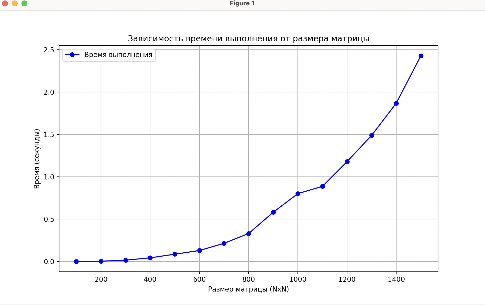
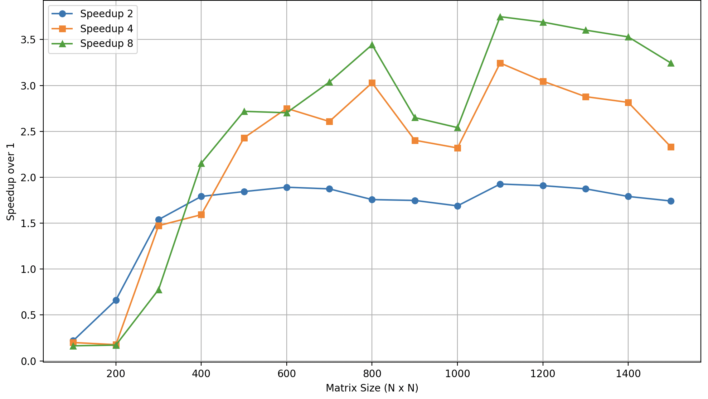
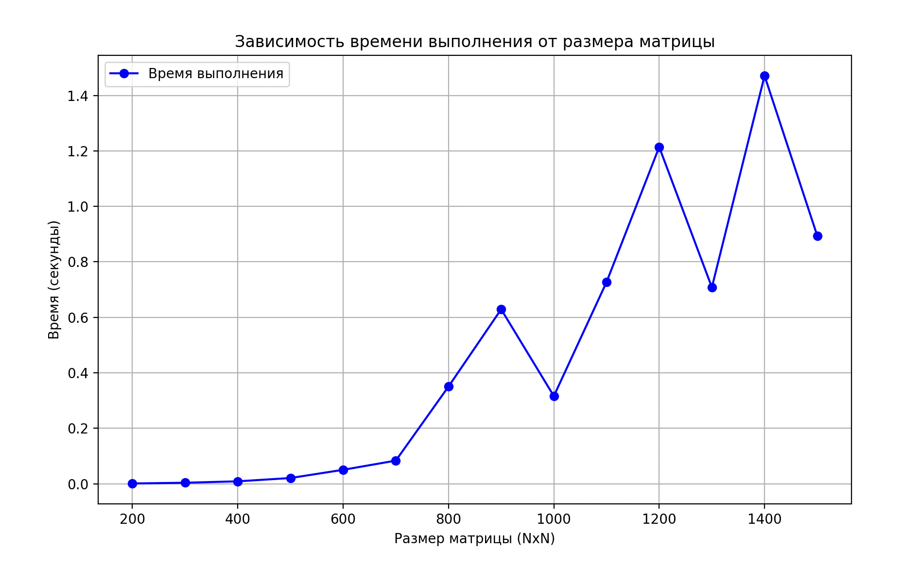
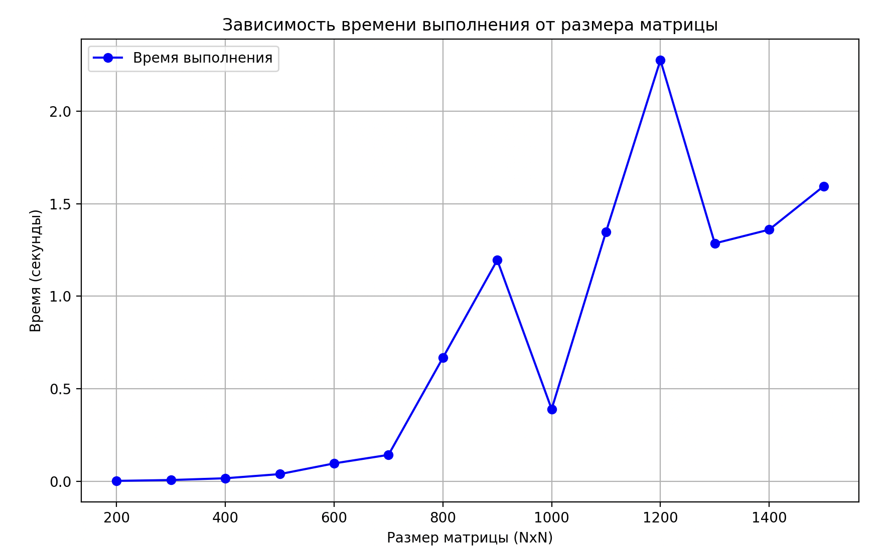
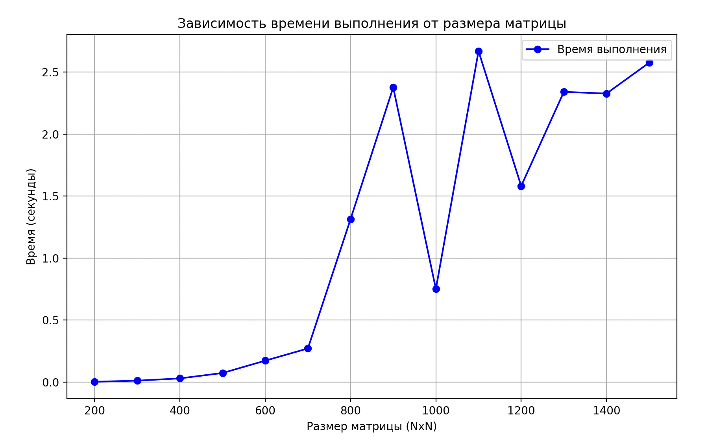
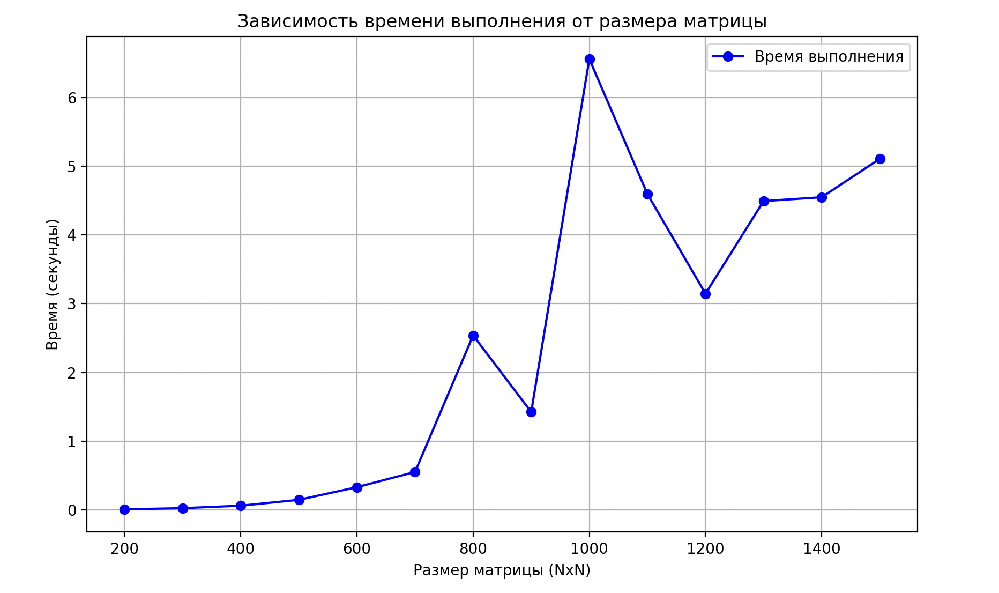

## Лабораторная работа 3

##### График зависимости времени от размеров матрицы

В этой программе реализовано параллельное умножение матриц с использованием MPI (Message Passing Interface). 
В лабораторной вычисления производились на Macbook Air M4.

### ⚙️ Алгоритм работы

1. **Матрица A**  
   - Разделяется по строкам между всеми доступными процессами.  
   - Распределение строк учитывает остаток от деления `rows % size`, чтобы равномерно загрузить все процессы.  
   - Передача данных реализована через `MPI_Scatterv`.

2. **Матрица B**  
   - Полностью рассылается всем процессам.  
   - Передача осуществляется с помощью `MPI_Bcast` в виде одномерного массива (flattened).

3. **Параллельное умножение**  
   - Каждый процесс умножает свою локальную подматрицу A на полную матрицу B.  
   - Результат сохраняется в локальной части итоговой матрицы C.

4. **Сбор итоговой матрицы C**  
   - Части итоговой матрицы (результаты каждого процесса) собираются на процессе с рангом 0.  
   - Используется `MPI_Gatherv` для корректной сборки с учётом неравномерного распределения строк.

5. **Коммуникации**  
   - `MPI_Bcast`: передача размерностей и полной матрицы B всем процессам.  
   - `MPI_Scatterv`: рассылка строк матрицы A.  
   - `MPI_Gatherv`: сбор итоговой матрицы C на процессе 0.

### 📌 Примечание

- Формат хранения матриц: текстовые файлы, где первая строка содержит размеры (строки и столбцы), далее — значения.  
- Умножение корректно сравнивается с `numpy.dot` для проверки точности (`np.allclose`).

###  8 процессов

###  4 процесса
[alt text](image-1.png)

###  2 процесса

###  1 процесса

###  Королев

- Большое спасибо ему https://github.com/Amitroki

###  8 процессов

###  4 процесса

###  2 процесса

###  1 процесса
