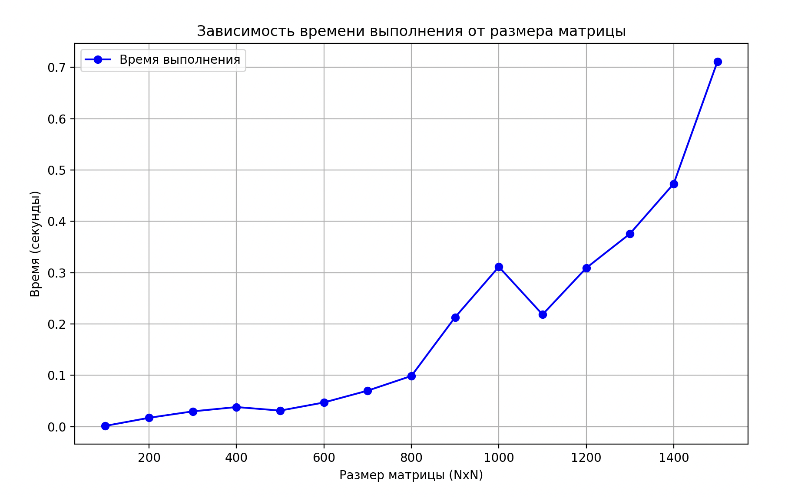
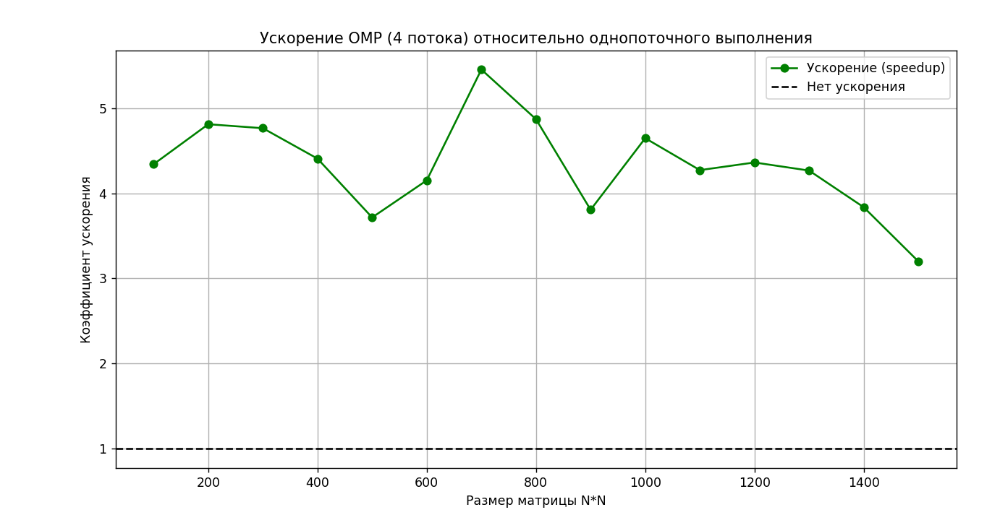
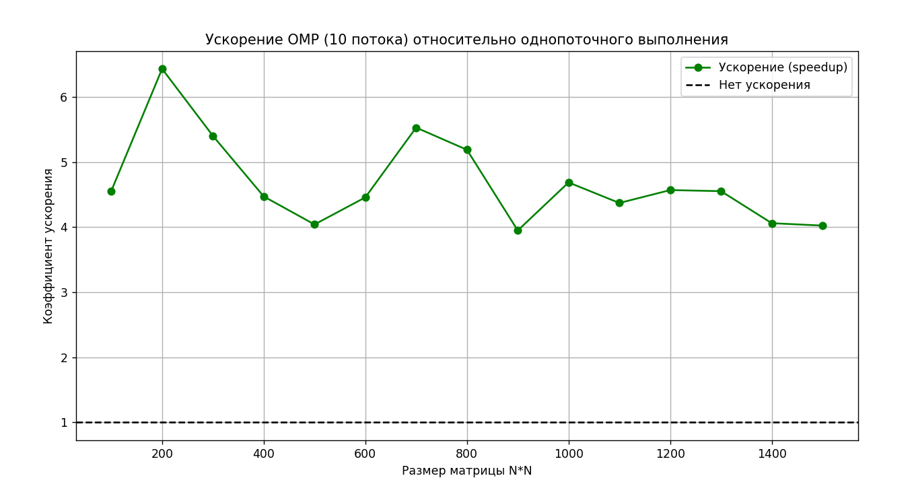

## Лабораторная работа 2

##### График зависимости времени от размеров матрицы

В рамках 2 лабораторной работы, модифицирована программа из л/р №1 для параллельной работы по технологии OpenMP. В перегрузку оператора * для умножения матрицы добавлены #pragma omp parallel num_threads() и #pragma omp for. 

Матрицы генерируются по 10 раз размера от 100 до 1500. Ниже представлены графики с использованием OpenMP и сравнение с последовательным выполнением. Первое фото это график зависимости времени выполнения от размера матрицы при использовании 4 потоков. 

Втрой график это график с использованием OpenMP 4 потоков и сравнение с последовательным выполнением.

Третий график это график с использованием OpenMP 10 потоков и сравнение с последовательным выполнением.

При переходе с 1 потока на 4 наблюдается существенное ускорение, что демонстрирует эффективность распараллеливания.
Дальнейшее увеличение потоков (с 4 до 10) не даёт пропорционального прироста производительности, что может быть связано с накладными расходами на управление потоками.
